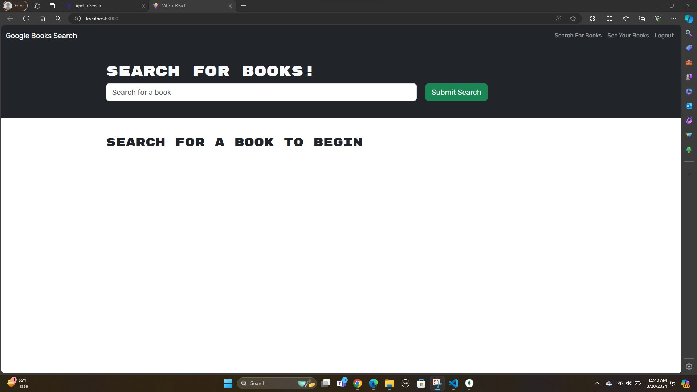
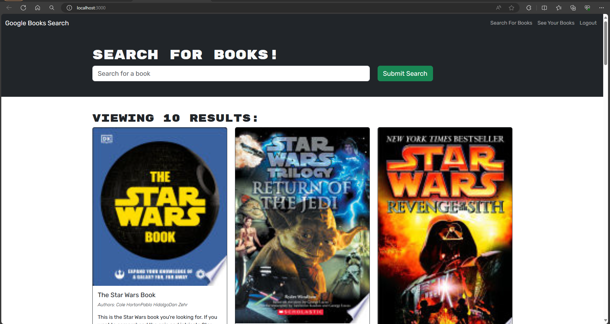
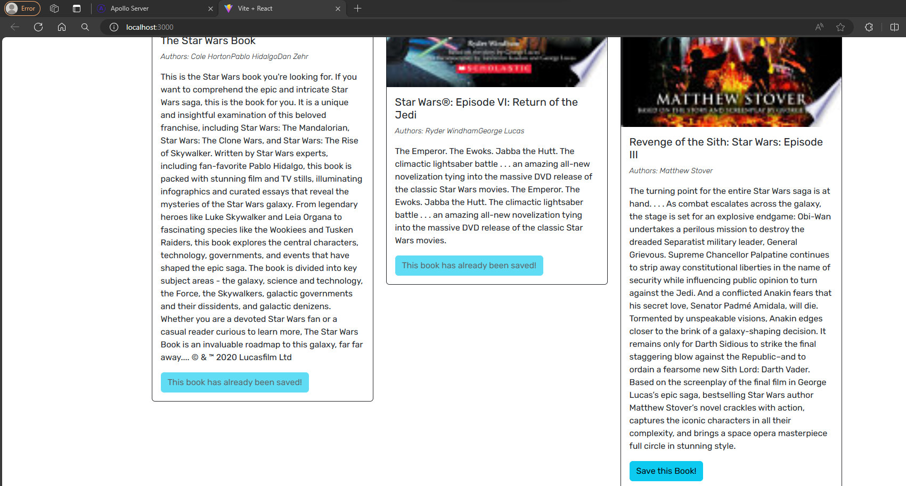
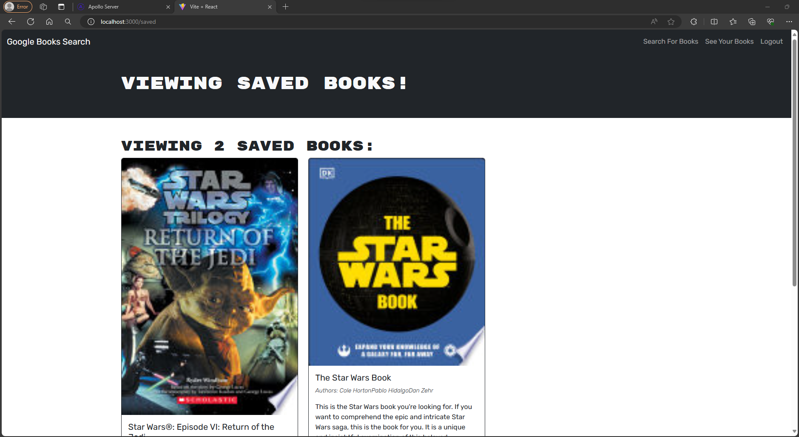

# Description

- This is a MERN stack (MongoDB, Express.js, React.js, Node.js) application that searches Google Books for a given book title, then displays the results. It has a user login function that then provides a method to save desired book titles from the search results to the logged in user's account. The internal database API functions are provided through a GraphQL API using Apollo Server. Security for app is provided by JSON Web Tokens and the jwt-decode module for the client side.

# Technologies

- MongoDB
- Express.js
- React.js
- Node.js
- JavaScript
- GraphQL API
- Apollo Server

# Usage

- This application allows to search for the books, save books to your saved book list and remove books from the saved book list.

# Installation

- To run this project, install it locally using npm install

# Usage

- After installing npm packages, the application will be invoked by using the following command: npm run develop

# References

- Referred in google took help rom instructor and Learing Assistant

[Github](https://github.com/RoopaThimmanacherla/book-search-engine)

[Deployed Application on Render](https://book-search-engine-3.onrender.com/)
